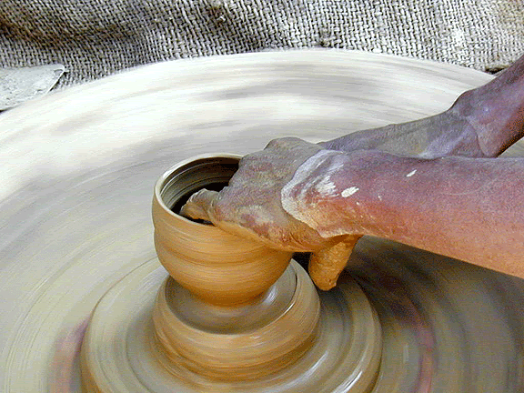
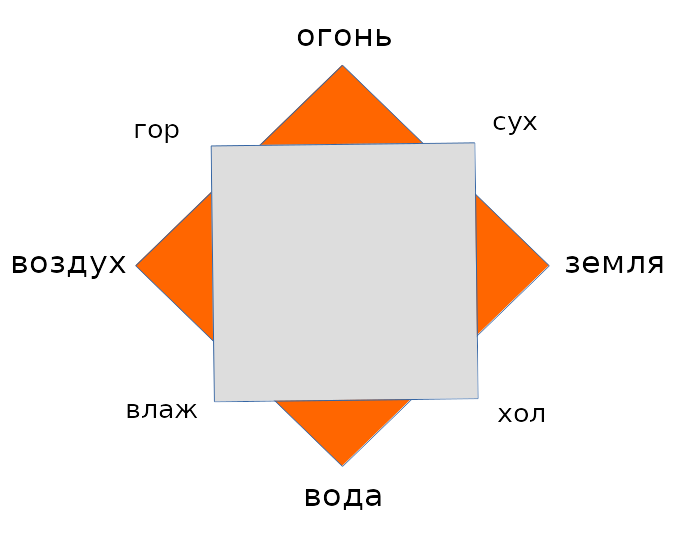

# Природа материи в трудах святых отцов. 

*"Изумление пред великими предметами не уменьшается, когда открыт способ, каким произошло что-нибудь необычайное. А если и не открыт, то простота веры да будет крепче доказательств от ума".* [^bas100]

Основой суждений о материи у святых отцов служит начало книги Бытия.
В противовес языческому учению о самопроизвольности мира (τὸ αύτόματον), отцы защищают идею сотворенности вещества.

Некоторые еретики понимали слова "Земля же бе невидима и неустроена" (Быт 1:2) как указание на вечность материи. Так еретик II века Гермоген, обличаемый Тертуллианом, считал, что «земля» = материя, и «бе» означает, что она существовала вечно[^rasm2]. 

С этим учением и полемизируют защитники христианских взглядов.

## Иломорфическая теория Аристотеля: 

Иломорфизм подразумевает в суждении о вещах различение сущности (ἡ ὕλη, ἡ ούσία) и формы (ἡ μορφή).

Иллюстрацией этого представления может послужить аналогия горшечника и бесформенной глины, которой придаются свойства сосуда. 

{width=350 height=350}

Материя у Аристотеля вечна. Хотя Бог, Демиург и творит мир, но он творит его из вечной материи. Сущность, материя находится в основе всех вещей. Если бы она имела начало, то было бы что-то являющееся основой материи. Такой основы Аристотель не усматривает и делает вывод, что материя вечна. Знаменитое «τὸ αύτόματον».

Эту мысль учителя Церкви считают крайне вредной и опасной, ведь в христианской традиции утвердилось мнение, что Бог творил мир из вечной материи, а не "из ничего".

Впрочем, в отношении иломорфизма, по-видимому, существовали разные мнения. Так Ориген соглашается с Аристотелем в том, что вещи слагаются из материи (materia) + свойств (qualitates), но выступает против того, чтобы считать материю вечной (De Princ II.1.4, Eusebius, Praep. eu., VII 20.1) [^rasm1]

Аргументы Оригена: 

1. ἡ δύναμις τοῦ Θεοῦ = Сила Божия. 

Кто говорит, что Бог не сотворил материю, тот ограничивает силу Бога 

>«Мы должны спросить его о силе Божией, разве Бог, если Он хочет устроить то, что избирает, при том что нет изъяна или немощи в его воле, не может устроить то, что Он избирает».

<!-- (криво, и двойной перевод) -->

Получается, что Богу «повезло», что он нашел материю (да еще в нужном количестве и способную принять те свойства, которые нужны. Если же это - не результат случайности, то существует некий anterior providence (предшествующий замысел, промысел - πρόνοιά τις πρεσβυτέρα Θεοῦ) (diss 96)

Отличная мысль автора дисс: предположим, Бог создал бы более совершенный мир (именно такой, как хотел), если бы сотворил вещество из ничего, чем тот мир, который Он создал бы, творя из уже существующей материи (с определенными свойствами). Выходит, что Бог ограничен уже существующей материей (не может сотворить материю, которая на самом деле для этого нужна) и потому не может создать лучший мир.

<!--
2. pronoia = Промысел?
-->

Если материя может быть не сотворенной Богом, значит так же могут существовать несотворенными и «качества» (poiothtas)
>(см. Eusebius, Praep. eu., VII 20.2)

<!-- Критика вечной материи у св Василия - (diss 94) -->

### Критика иломорфизма у св. Василия. 

Святитель говорит о том, что не существует "подлежащей сущности", напр. у земли. Если отнять все предикаты земли, то не останется ничего.

>"...предпишем себе ... не любопытствовать об ее сущности, что она такое, не тратить времени на умствования, исследуя самое подлежащее, не доискиваться какого-то естества, которое лишено качеств, и само в себе взятое безкачественно, но твердо помнить, что все свойства, усматриваемые в земле, будучи восполнением сущности, входят в понятие бытия. Покусившись отвлечь разумом от земли каждое из находящихся в ней качеств, придешь ни к чему. Ибо если отнимешь черноту, холодность, тяжесть, густоту, качества земли, действующие на вкус, или и другие, какие в ней усматриваются, то подлежащим останется ничто". [^bas3]

Критика вечной материи св. Василием:

1. Если материя совечна Богу, то они уравниваются в чести, что нечестиво.

>"Ибо материя, рассуждают они, по природе своей невидима и неустроена, потому что сама в себе взятая бескачественна, не имеет никакого вида и очертания. И ее-то взяв, Художник, по Своей премудрости, образовал и привел в порядок, а таким образом осуществил из нее видимое.
Итак если материя не сотворена, то, во-первых, она равночестна Богу, как удостоенная тех же преимуществ. Но что может быть сего нечестивее"?[^bas5]

2. В отношении могущества и разума Божия:

* Материи достаточно для Творения мира, она достаточна для того, чтобы "измерить разум Божий".

> "Во-вторых, если материя так вместительна, что может принять в себя все ведомое Богу, то чрез это сущность материи уравнивают они некоторым образом с **неисследимым Божиим могуществом**, как скоро материя **достаточна** к тому, чтобы измерить собою весь разум Божий"[^rasm3].

* Материи недостаточно, Бог принуждается к бездействию:

> "А если материя **мала для Божьего действования**, то и в таком случай учение их обратится в нелепую хулу, потому что недостаточностью материи заставят они Бога остаться в бездействии и не довершить дел Своих".

3. Недостаток аналогии ремесленника и материала:

> "В следствие сего они отрицают, чтобы великий Бог был полновластен при устроении всего сущего, представляют же Его как бы участвовавшим в складчине и малую только долю вложившим от Себя в бытие существ".

> «Сотвори Бог небо и землю», не в половину каждое, но целое небо и целую землю, самую сущность, взятую вместе с формою, потому что Он не изобретатель только образов, но Зиждитель самого естества существ.

<!--
прп Максим Исповедник:

>помимо “просто называемой материи”, подразделяемой на четыре части (имеются в виду, вероятно, стихии – А. С.), есть ещё и “вид” (tO e?doj). Вследствие чего природа состоит из материи и вида, или же является “материей, обретшей вид”. См. PG 91, 1396–1397
-->

## Атомизм

Описание атомизма Демокрита у св. Василия:

>«другие же представляли себе, что природу видимых вещей составляют атомы и неделимые тела, тяжесть и скважинность, потому что рождение и разрушение происходят, когда неделимые тела то взаимно сходятся, то разлучаются, а в телах, существующих долее других, причина продолжительного пребывания заключается в крепчайшем сцеплении атомов»[^bas1].

>«Подлинно ткут паутинную ткань те, которые пишут это, и предполагают столько **мелкие и слабые начала** неба, земли и моря. Они не умели сказать: «В начале сотвори Бог небо и землю». Потому вселившееся в них безбожие внушило им ложную мысль, будто бы все пребывает без управления и устройства, и приводится в движение как бы случаем»[^bas2].

Св. Григорий Богослов, опровергая существование "телесности Божества", в одном из аргументов упоминает атомизм: 

>"или (Бог) смешается с ними, как жидкость, и иное будет делить, а иным делиться, что нелепее и бессмысленнее Эпикуровых атомов"[^grig1].

>"рази Эпикурово безбожие, его атомы и чуждое любомудрию удовольствие;"[^grig3]

На самом деле проблема не в мелкости и слабости атомов, а в том, что Демокрит (и его предшественник Левкипп) считал, что атомы обладают необходимым бытием. Атомы не разрушаются (α-τομος) и не возникают. Но необходимым, необусловленным бытием согласно христианским взглядам обладает только Бог. По-видимому именно в этом лежит одна из причин отвержения атомизма св. Василием.

Вторая причина - случайность движения атомов и их соединение в случайном порядке. Здесь очевидно противоречие языческого понятия случайности, судьбы (ἡ μοῖρα) с Промыслом Божиим (ἡ πρόνοια τοῦ Θεοῦ), подразумеваемым христианским мировоззрением.

Идея о неделимости атомов (α-τομος) отталкивала св. Василия потому, что неделимый атом соперничает с неделимым, простым Богом.

Возможно дело и в том, что древнегреческий атом «невидим», так же как Бог.

Какую же альтернативу атомизму видят святые отцы?

## Система четырех стихий Аристотеля.

{width=350 height=350}

У св. Василия Бог имеет дело не с уже существующей материей (пусть даже и заранее сотворенной), а сообщает вещам сразу и бытие, и свойства. Видимо, по этой причине святитель принимает на вооружение аристотелевскую систему 4х стихий.

>"Впрочем и земля, и вода, и воздух, и огонь, только как первые стихии сложных вещей, представляются разуму с поименованными качествами..., земля суха и холодна, вода влажна и холодна, воздух тепел и влажен, а огонь тепел и сух"[^bas4].

Свойства стихий позволяют им смешиваться и составлять конкретные вещи: 

>"Таким образом, вследствие сопряженного качества, происходит в стихиях возможность смешиваться каждой с каждою, ибо каждая стихия, в следствие общего качества, срастворяется с смежною к ней стихией, а вследствие общения в сродном, соединяется и с противоположною". 

Отношение между стихиями: 

>"Например, земля, будучи суха и холодна, соединяется с водою по сродству холодности, а чрез воду соединяется с воздухом, потому что вода, поставленная в средине между землею и воздухом, каждым из своих качеств, как бы наложением двух рук, соприкасается к той и другой из прилежащих к ней стихий, – холодностью к земле, а влажностью к воздуху. Опять, воздух чрез посредство свое делается примирителем враждебных природ воды и огня, вступая в единение посредством влажности – с водою, а посредством теплоты – с огнем. А огонь, будучи по природе тепел и сух, посредством теплоты соединяется с воздухом, а посредством сухости входит опять в общение с землею. И таким образом составляется круг и стройный лик, по причине взаимного согласия и соответствия всех стихий...".
   Это сказал я, чтобы представить причину, почему Бог землю назвал сушею, а не сушу нарек землею.
Именно, сухость есть нечто не в последствии приданное земле, но с самого начала восполнявшее ее сущность". 

Св. Григорий Богослов, вероятно тоже предпочитал теоргию четырех стихий:

>"От этого-то стали поклоняться, кто солнцу, кто луне, кто множеству звезд... а кто стихиям: земле, воде, воздуху, огню, так как они для всего необходимы, и без них не может длиться жизнь человеческая". [^grig2]

прп. Иоанн Дамаскин придерживается той же "классической" схемы:

>"Всякое же тело составлено из 4х стихий, а тела живых существ - из 4х влаг"[^dam1].

>"Должно же знать, что есть *четыре стихии*: *земля*, которая - суха и холодна; *вода*, которая - холодна и влажна; *воздух*, который - влажен и горяч; *огонь*, который - горяч и сух"[^dam2]. 

Св. Максим Исповедник 

>"Верхняя же одежда есть чувственный мир, разделяемый четырьмя стихиями;" (Вопросоответы к Фалассию, вопрос 4)

Св. Афанасий, по-видимому под стихиями понимает не воду, огонь и т.д., а определенные свойства материи, что немного расходится с обычным аристотелевским определением стихий:

>"Кто же при всей малосмысленности не знает, что четыре стихии, из которых образовалось естество тел, - разумею теплоту и холод, сухость и влажность, - поддерживаются только в совокупном соединении, а разделенные и разобщенные от преобладания преизбыточествующей из них, делаются уже одна для другой разрушительными?" [^ath1]

Можно сказать, что общий скептицизм церковных писателей в отношении атомизма - некий теологумен в богословии, вплоть до 17-18 веков, когда теория атомизма вновь начинает рассматриваться всерьез на основании физических опытов, проделанных учеными и выясняется, что она верна.

## Выводы: 

Главной заслугой св. Василия в отношении Шестоднева является то, что он "естество сущих уяснил" (Тропарь святого).

* святые отцы однозначно высказываются в поддержку модели, объясняющей действительность с помощью четырех стихий Аристотеля, истолковывая с их помощью Бытие. 
* Это открывает путь к истолкованию книги Бытия с помощью современных научных данных
* Это ставит вопрос о мнении некоторых отцов, говорящих о сотворении мира в точности за шесть дней.

>"Сказавший: «в начале сотвори Бог небо и землю», умолчал о многом: о воде, о воздухе, об огне, и о видоизменениях, из них происшедших. Хотя все это, как служащее к восполнению мира, очевидно, существовало в целом, **однако же история не коснулась сего, чтобы приучить ум наш к самодеятельности**, и дать ему случай по немногим данным делать заключения и о прочем". (св. В, Шест, 2)

Получается: 
- В начале сотворил Бог небо и землю, - говорит Библия.
- Из четырех стихий (добавляют отцы)

Почему нельзя продолжить этот диалог:
- В шесть дней...
- Дни - это условное обозначение периодов

Тем более, что один из древних отцов высказался в пользу именно такого понимания (блж. Августин)
«Один день, как тысяча лет».

\newpage

**Литература:**

[^bas1]: @BasilShest, С. 3-4
[^bas2]: @BasilShest, С. 3-4
[^bas3]: @BasilShest, С. 14
[^bas4]: @BasilShest, С. 70
[^bas5]: @BasilShest, С. 23
[^bas100]: @BasilShest, С. 18
[^ath1]: @AthanPag, С. 161
[^grig1]: @GrigNaz1, С. 396
[^grig2]: @GrigNaz1, С. 400
[^grig3]: @GrigNaz1, С. 391
[^dam1]: @DamasToch, С. 81
[^dam2]: @DamasToch, С. 82
[^rasm1]: @Rasm, p. 95
[^rasm2]: @Rasm, p. 93
[^rasm3]: "ὅλην ὑποδέχεσθαι τοῦ θεοῦ τὴν ἐπιστήμην". Цит по: @Rasm, p. 103

